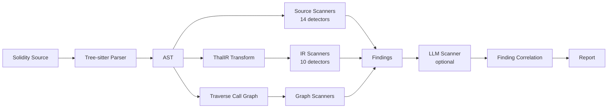

## What is Tameshi?

**Tameshi** (試し, Japanese: "test" or "trial") reflects the practice of testing a blade's sharpness. Like a swordsmith meticulously examining their work, Tameshi tests smart contracts with precision and thoroughness.

Tameshi is a real-time vulnerability scanner for Solidity smart contracts. It combines:

- **Source-level scanning** - Fast AST analysis, works on incomplete/invalid code (<1s)
- **IR-level scanning** (via ThalIR) - Semantic analysis through intermediate representation
- **Call graph analysis** (via Traverse) - Control flow and cross-function vulnerability detection
- **LLM-powered analysis** (optional) - AI validates and augments deterministic findings

**Works on incomplete code**: Tree-sitter parser handles syntactically invalid Solidity during active development. No compilation required. Get security feedback as you type.

## Who is Tameshi for?

**Solidity Developers** - Get instant security feedback as you type. No waiting for compilation. Catch vulnerabilities in incomplete code during active development.

**Security Researchers** - Run comprehensive audits combining deterministic pattern matching with optional LLM analysis for higher confidence.

**Smart Contract Auditors** - Generate detailed reports with severity ratings, confidence scores, and SARIF export for client deliverables.

## Analysis Pipeline

## Key Capabilities

### Real-Time Analysis on Incomplete Code

Fast scans (<1s) on code under construction:
- Works on syntactically invalid Solidity
- No compilation required
- Tree-sitter parser handles partial code
- Get feedback during active development, not just on complete code

### Multi-Tier Detection

**Four complementary analysis layers**:
- 14 source-level scanners for fast AST analysis
- 10 IR-level scanners for semantic precision via ThalIR
- Call graph scanners for control flow and cross-function analysis via Traverse
- 1 LLM scanner (optional) for validation and novel pattern discovery
- Finding correlation engine links related issues across scanners

### Vulnerability Coverage

**9 major security categories**:
- Reentrancy (classic, cross-function, read-only)
- Access control and privilege escalation
- Integer arithmetic vulnerabilities
- Dangerous operations (delegatecall, selfdestruct)
- Denial of Service patterns
- Unchecked external calls
- Time dependencies and miner manipulation
- Price manipulation and oracle attacks
- State modification issues

### VSCode Integration

**Security feedback as you type**:
- Inline diagnostics appear instantly (<1s)
- Smart AI rescan on modified lines only
- Findings triage with correlation grouping
- SARIF export for GitHub Code Scanning

## Get Started

1. [Install Tameshi](/install) - Set up the CLI and VSCode extension
2. [Run your first scan](/quick-start) - 5-minute tutorial
3. [Explore scanners](/scanners) - See what vulnerabilities Tameshi detects
